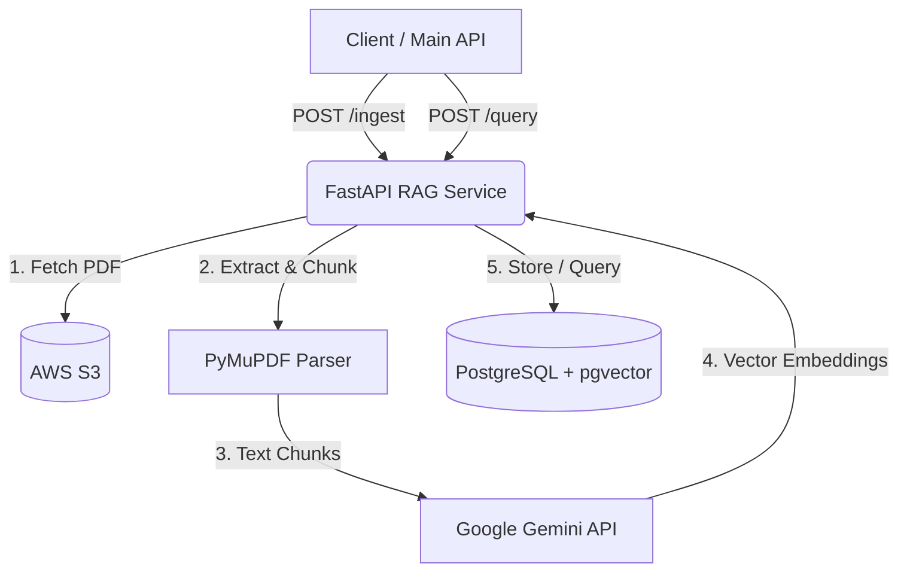

<div align="center">
  <h1>🏥 CareConnect RAG Service</h1>
  <p><i>A powerful Retrieval-Augmented Generation (RAG) engine for CareConnect</i></p>

  
  
  
  
  
</div>

---

## 📖 Overview

The **CareConnect RAG Service** is a dedicated microservice built to process, index, and retrieve medical documents (such as PDFs, lab reports, and patient records) using advanced AI capabilities. 

Built with **FastAPI**, **PostgreSQL (`pgvector`)**, and **Google Gemini Embeddings**, this service provides sub-second semantic search. It securely downloads documents from **AWS S3** via presigned URLs, converts their content into high-quality vector embeddings, and ensures complete multi-tenancy isolation between different doctors and patients.

## ✨ Key Features

- **📄 Automated Document Ingestion**: Fetches medical PDFs securely from S3, extracts text using PyMuPDF, and robustly chunks content.
- **🧠 Advanced Vector Embeddings**: Leverages Google Generative AI to generate dense semantic vectors for precise information retrieval.
- **⚡ Lightning-Fast Semantic Search**: Utilizes PostgreSQL with `pgvector` for efficient approximate nearest-neighbor search.
- **🔒 Multi-tenant Security**: Hardened document isolation by strictly filtering queries based on `Doctor ID` and `Patient ID`.
- **🐳 Fully Containerized**: Ships with a ready-to-use Docker environment for frictionless deployment and local testing.

## 🏗️ Architecture



## 💻 Tech Stack

- **Core**: Python 3.10+, FastAPI, Uvicorn
- **AI/ML**: Google Generative AI SDK (Gemini), PyMuPDF
- **Database**: PostgreSQL 16, SQLAlchemy, `pgvector`
- **Cloud/Infra**: AWS S3 (boto3), Docker, Docker Compose

## 📁 Project Structure

```text
careConnect-rag-server/
├── app/
│   ├── api/            # FastAPI route handlers
│   ├── services/       # Core business logic, parsers, and AWS integrations
│   ├── models.py       # SQLAlchemy ORM models
│   ├── schemas.py      # Pydantic validation schemas
│   ├── database.py     # DB connection and session management
│   ├── config.py       # Configuration & Env vars
│   └── main.py         # Application factory and entrypoint
├── test_ingest.py      # Test scripts for ingestion
├── docker-compose.yml  # Docker environment orchestration
├── Dockerfile          # Container build instructions
├── requirements.txt    # Python dependencies
└── example.env         # Environment variables template
```

## 🚀 Getting Started

### Prerequisites
- [Docker](https://www.docker.com/) and Docker Compose
- AWS IAM Credentials with S3 Read access
- Google Gemini API Key

### 1. Clone & Setup
```bash
git clone https://github.com/sharma-dikshant/careConnect-rag-server.git
cd careConnect-rag-server
```

### 2. Configure Environment
Create a `.env` file in the root directory (using `example.env` as a template) and configure the secrets:
```env
# Database Configuration
POSTGRES_USER=user
POSTGRES_PASSWORD=password
POSTGRES_DB=ragdb
DATABASE_HOST=db
DATABASE_PORT=5432

# AWS S3 Configuration
AWS_ACCESS_KEY_ID=your_aws_access_key
AWS_SECRET_ACCESS_KEY=your_aws_secret_key
AWS_REGION=us-east-1

# AI Platform
GEMINI_API_KEY=your_gemini_api_key
```

### 3. Build and Run
Start the entire stack (PostgreSQL + API) seamlessly via Docker:
```bash
docker compose up --build
```
*The API will be available at `http://localhost:8000` (`uvicorn` default port locally) or `http://localhost:8080` depending on your docker compose mapping.*

You can also run locally without docker:
```bash
pip install -r requirements.txt
uvicorn app.main:app --reload
```

## 🔌 API Reference

### Health Check
Validates if the API is running correctly.

- **URL**: `/health`
- **Method**: `GET`
- **Response**:
```json
{
  "status": "healthy"
}
```

### 1. Ingest Document
Downloads a PDF from a given URL (e.g., S3 presigned URL), parses its contents, generates vectorized embeddings, and indexes them in the Postgres pgvector database.

- **URL**: `/ingest`
- **Method**: `POST`
- **Payload**:
```json
{
  "file_url": "https://s3.amazonaws.com/your-bucket/reports/123/blood_test.pdf",
  "doctor_id": "doc-123",
  "patient_id": "pat-456"
}
```

### 2. Semantic Query
Searches the vector database for text segments semantically similar to the prompt and returns an AI-generated answer based on the context.

- **URL**: `/query`
- **Method**: `POST`
- **Payload**:
```json
{
  "query": "What are the patient's cholesterol levels?",
  "doctor_id": "doc-123",
  "patient_id": "pat-456",
  "limit": 5
}
```
- **Response**:
```json
{
  "answer": "The patient's cholesterol is 180 mg/dL based on the recent test report.",
  "sources": [
    {
      "content": "...Total Cholesterol: 180 mg/dL...",
      "source_file": "blood_test.pdf"
    }
  ]
}
```

## 🤝 Contributing
Contributions, issues, and feature requests are welcome! Feel free to check the issues page.
